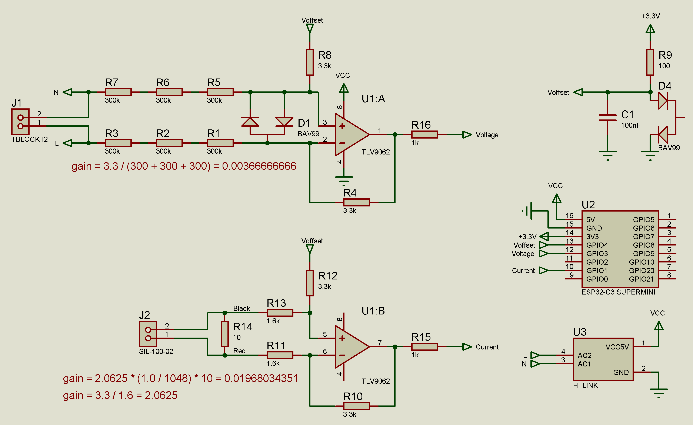
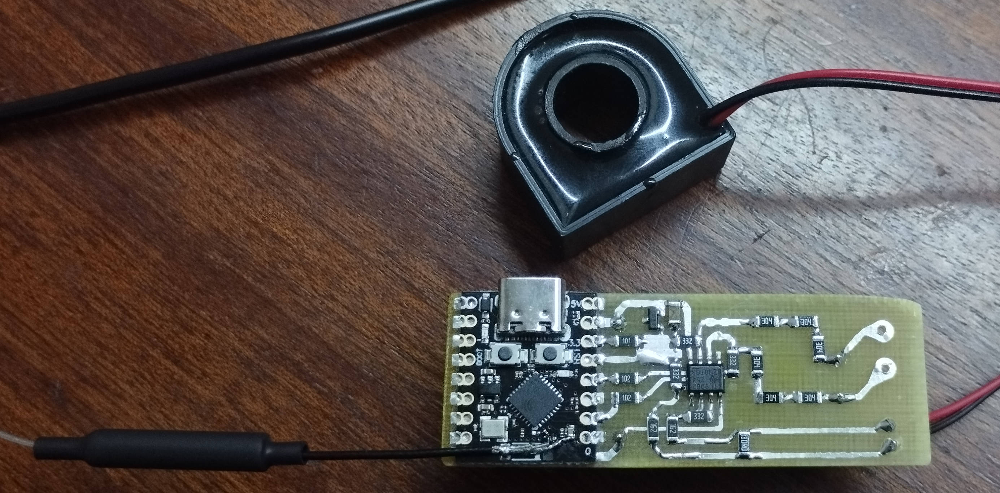

# Energy Monitor

This project is an ESP32-based energy monitoring device designed for smart home integration. It measures key electrical parameters from the grid, including RMS voltage, RMS current, active power, power factor (cos φ), and frequency. The data is published via MQTT to allow seamless integration with platforms like Home Assistant. The device uses high-speed ADC sampling with median filtering for accurate readings, supports over-the-air (OTA) updates, and includes a web-based configuration interface for easy setup.

The project is built for the ESP32-C3 SuperMini board and is ideal for monitoring power consumption in real-time, helping with energy efficiency in home automation systems.

## Features

- **Measurements**: Calculates RMS voltage (Vrms), RMS current (Irms), active power (P), power factor (cos φ), and grid frequency (Hz).
- **High-Speed Sampling**: Uses ESP32's ADC in continuous mode with DMA for sampling at approximately 30 kHz, capturing about 5 periods in 100 ms for precise calculations.
- **Noise Reduction**: Applies a median filter to raw ADC data to minimize noise and improve accuracy.
- **Calibration**: Supports user-defined calibration factors for voltage and current to fine-tune measurements.
- **MQTT Integration**: Publishes JSON-formatted data every 5 seconds to a configurable MQTT broker. Includes support for login/password authentication.
- **Home Assistant Discovery**: Automatically sends MQTT discovery configuration for easy integration with Home Assistant (sensors for voltage, current, power, power factor, and frequency).
- **Web Configuration**: Uses a captive portal (AP mode) for setting MQTT server details and calibration coefficients via a simple web interface.
- **OTA Updates**: Supports over-the-air firmware updates using ArduinoOTA.
- **Logging**: Serial logging for debugging and a basic JSON log in the web interface.

## Hardware Requirements

- **Microcontroller**: ESP32-C3 SuperMini (or compatible ESP32 board).
- **Power Supply**: Hi-Link HLK-PM01 AC-DC module (input: 85-265VAC, output: 5V DC at up to 600mA, 3W, with 3kV isolation for safety). This provides stable power directly from the mains.
- **Sensors**:
  - **Current Sensor**: Non-invasive current transformer (CT) rated for 100A primary current with a 1000:1 turns ratio (secondary current: ~100mA at 100A load).
  - **Voltage Sensor**: Simple resistive voltage divider to step down mains voltage (e.g., 220V AC) to a low-level signal suitable for the ADC.
  - **Signal Conditioning**: Both current and voltage signals are scaled and offset using a TLV9062 operational amplifier. This ensures the signals are biased to the ADC's midpoint (~1.44V) and amplified to fit the ADC range. An additional offset reference is connected to GPIO4 (ADC1_CHANNEL_4) for bias measurement and subtraction.
- **Schematic**: Refer to the provided schematic for connections: .
- **Assembled Photo**: See the real-world assembly: .

**Warning**: This project involves working with mains voltage, which can be dangerous. Ensure proper isolation and follow safety guidelines. The author is not responsible for any damage or injury.

## Software Dependencies

- **Platform**: Espressif32 (version 6.10.0 or later).
- **Framework**: Arduino.
- **Libraries**:
  - PubSubClient (for MQTT) - version 2.8.
  - ArduinoJson (for JSON handling) - version 7.4.2.
  - ApSettingsManager (custom library from https://github.com/Tsukihime/ApSettingsManager.git) - for web configuration.
- **Build Tool**: PlatformIO (recommended for building and uploading).

## Building and Flashing

1. Install PlatformIO (via VS Code extension or standalone).
2. Clone the repository: `git clone https://github.com/Tsukihime/EnergyMonitor.git`.
3. Open the project in PlatformIO.
4. Build the project: Run `platformio run` in the terminal.
5. Upload to the board: Connect the ESP32 via USB and run `platformio run --target upload`.
6. For OTA uploads: Set `upload_protocol = espota` and `upload_port = energymonitor.local` in `platformio.ini` (after initial flash).

The project uses custom build flags like increased MQTT packet size (2048) and USB CDC mode for debugging.

## Configuration

1. **Initial Setup**:
   - After flashing, the device starts in Access Point (AP) mode with SSID based on the device name (e.g., "EnergyMonitor").
   - Connect to the AP.
   - Open a browser and go to "192.168.4.1".

2. **Web Interface Parameters**:
   - **MQTT Settings**:
     - Server: IP or domain (e.g., "192.168.0.1").
     - Port: Default 1883.
     - Login: MQTT username.
     - Password: MQTT password.
   - **Measurement Calibration**:
     - Current Coefficient: Multiplier for current calibration (default 1.0000).
     - Voltage Coefficient: Multiplier for voltage calibration (default 1.0000).

3. **Save and Reboot**: After saving, the device connects to Wi-Fi (configured via ApSettingsManager) and starts publishing data.

## Usage

- The device measures and publishes data every 5 seconds.
- MQTT Topic: `home/EnergyMonitor_<device_id>/state` (where `<device_id>` is the chip ID in HEX).
- Payload Example: `{"v_rms":220.5,"i_rms":1.23,"power":271,"cos_phi":0.985,"frequency":50.0}`.
- For Home Assistant: After connecting to MQTT, the device auto-discovers sensors under "Energy Monitor".
- Monitor via serial console (115200 baud) for debug logs.
- OTA: Use PlatformIO or Arduino IDE for updates; hostname is "EnergyMonitor".

If measurements fail (e.g., ADC error), it logs an error to serial.

## License

This project is open-source under the MIT License.

## Credits

Developed by Tsukihime.
